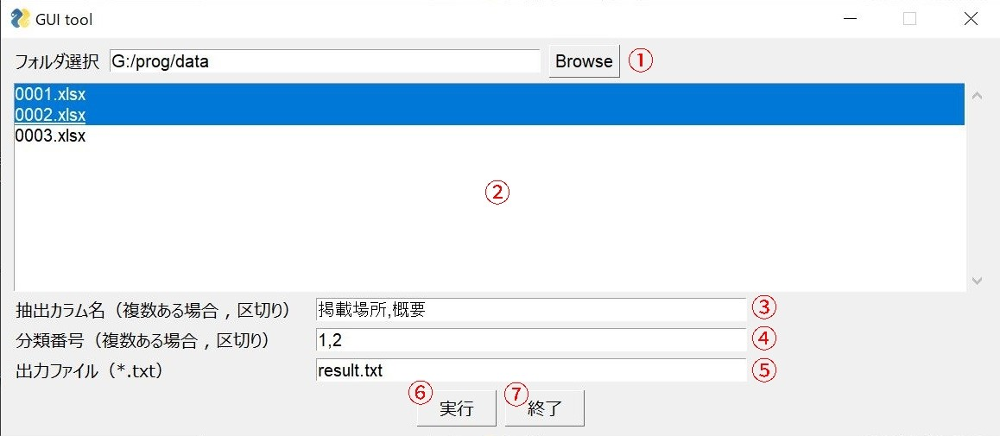

指定のxlsxファイルからのデータ抽出プログラム
====

xlsxのデータカラム（※記載例はdataフォルダ参照）
| 通し番号 | 著者名 | 論文名 | 掲載場所 | Vol No | ページ | 発表年 | 概要| 分類番号 |
| ---- | ---- | ---- | ---- | ---- | ---- | ---- | ---- | ---- |
| 数値 | 文字列 | 文字列 | 文字列 | 文字列 | 文字列 | 数値 | 文字列 | 数値 |

## Description

上記カラムを持つxlsxファイルに対し、条件を指定しデータ行の抽出を行うことができます。  
ファイルは複数指定することができます。

## How to Use

gui_tool.pyを実行すると、下記の画面が表示されます。 

   

**①フォルダ選択**  
「Browseボタン」を押すと、ファイルエクスプローラが立ち上がります。入力フォルダを選んでフォルダーの選択をすると、選択したフォルダに含まれるxlsxファイルの一覧が②の画面に表示されます。  

**②ファイル選択**  
フォルダを選択するとxlsxファイルが表示されますので、入力に使用するファイルを選択して下さい。上の画面では0001.xlsxと0002.xlsxを選択している例になっています。

**③抽出カラム名の選択**  
連結して出力する対象のカラム名を指定します。複数ある場合、「,（カンマ）」で区切って下さい。カラム名は「””（ダブルクォーテーション）」で囲う必要はありません（「掲載場所,概要」のような指定でOK）。なお、ここで指定されるカラム名は全て入力のxlsxファイルに含まれている必要があります。  
ここで指定された順序で、文字列が1行で連結されます。  

**④分類番号の選択**  
抽出したい分類番号の番号を指定します。指定は複数指定することができます。  

**⑤出力ファイル名の入力**  
出力するファイル名を記載してください。ここはデフォルトでresult.txtが指定されています。ファイルはexeファイルと同じフォルダに出力されます。  

**⑥実行ボタン、⑦終了ボタン**  
実行ボタンを押すと、プログラムの実行を行います。実行が完了すると、ポップアップで完了メッセージが表示されます。プログラム実行中は、再度実行のボタンを押しても実行することができません。  
終了ボタンを押すと、プログラムが終了します。

## Requirement

* openpyxl 3.0.9
* pandas 1.4.1
* pysimplegui 4.57.0

## Author

[nekunet](https://github.com/nekunet)